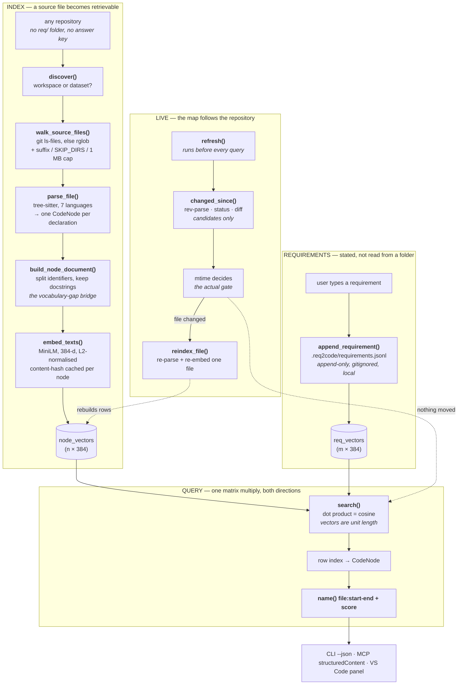
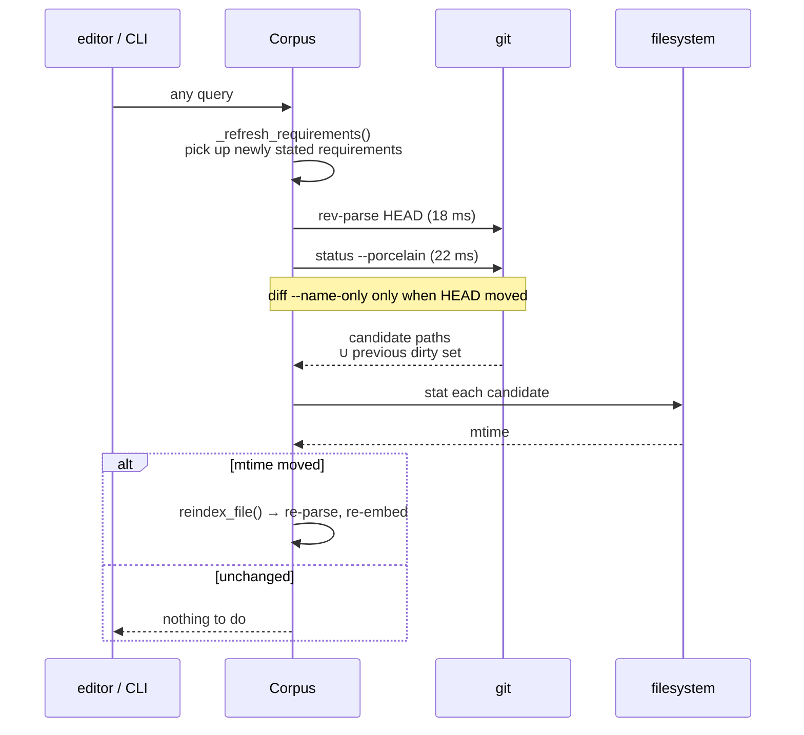
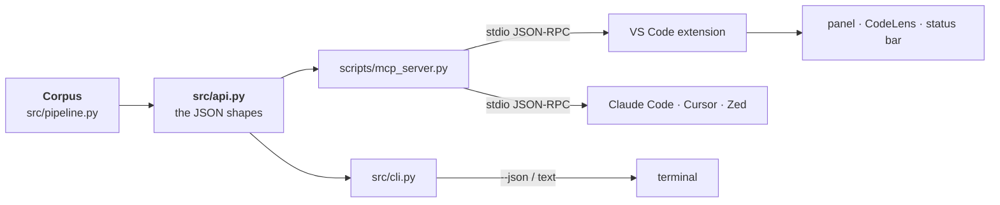

# How a mapping gets made

The path from a source file on disk to a ranked list of methods on screen, with
the function that does each step and what it costs.

Measured on this repository — 181 nodes, 43 files, Windows, CPU-only, warm
embedding cache. Reproduce with `python -m scripts.bench_latency` and the
`req2code` CLI.

---

## The whole thing at once



---

## Stage 1 — a source file becomes retrievable

| # | Step | Where | Cost |
|---|---|---|---|
| 1 | tree-sitter parse → one `CodeNode` per declaration | [parser.py:258](../src/parse/parser.py) | 1.9 ms |
| 2 | enclosing-class map, by line containment | [parser.py:362](../src/parse/parser.py) | ~0 ms |
| 3 | **node-document build** | [node_doc.py:136](../src/index/node_doc.py) | 2.0 ms |
| 4 | embed → 384-d unit vectors | [embedder.py:129](../src/index/embedder.py) | 7 ms cached / ~200 ms cold |

**Step 3 is the one that makes the rest possible.** Raw source is never embedded
— it is mostly syntax, in a vocabulary no English sentence model understands.
Instead a pseudo-English document is synthesised per node:

```
def diff_names(root: Path, old: str, new: str) -> set[str] | None:
    """Files that differ between two commits, or None if either is unreachable.
```

becomes

```
diff names files that differ between two commits or none if either is
unreachable unreachable is real case not defensive one rebase an amend
or gc can leave the sha we recorded at load time dangling ...
```

Splitting `diff_names` into "diff names" is what lets *"detect which files
changed"* match it with no shared keyword. That is the vocabulary gap, and
identifier splitting is the highest-leverage step in the project.

`nodes`, `node_documents` and `node_vectors` are always rewritten **together** —
row alignment is the invariant everything downstream indexes by.

---

## Stage 2 — staying live

[`refresh()`](../src/pipeline.py) runs at the top of every query, so nothing can
be stale.



Two rules make this safe:

- **Git supplies candidates; mtime decides.** Git can over-report freely — a
  false candidate costs one `stat`. There is no path where a git answer alone
  mutates the index, which is why the fallback for a non-git directory produces
  an identical index.
- **The union with the *previous* dirty set is load-bearing.** A file that was
  dirty and is now clean (undo, `git checkout -- file`) appears in no current
  listing: not in `status`, because it matches HEAD again; not in `diff`, because
  HEAD did not move. Without carrying the old set forward the index would serve
  the edited version forever.

| Event | Cost |
|---|---|
| edit a file → mapping follows | 75 ms |
| `git checkout` to a commit without a method | 77 ms |
| back onto the branch | 100 ms |
| idle check, nothing changed | 34–40 ms |

The idle figure is almost entirely Windows subprocess spawn for the two git
calls. It is inside the 100 ms interaction budget, and it is the first thing to
attack at scale — checking the mtime of `.git/HEAD` would replace one subprocess
with one stat.

---

## Stage 3 — a requirement becomes a ranking

```
user text
  → append to .req2code/requirements.jsonl     append_requirement()   ~0 ms
  → embed                                      embed_texts()          5.1 ms
  → dot product against the node matrix        search()               0.01 ms
  → row indices back to CodeNodes              corpus.nodes[i]
  → name() + file:start-end + score            display
```

The search is [one matrix multiply](../src/index/vector_store.py). Every vector
is L2-normalised at embed time, so cosine *is* the dot product — no per-query
division, no risk of normalising twice. `(1,384) × (384,181)` is 0.01 ms, and
still sub-millisecond at 2466 nodes.

The reverse direction is the same matrix, transposed:

```
(file, line)
  → innermost containing node    find_node_at()   retrieve/locate.py
  → its row in node_vectors      node_index()
  → dot against req_vectors      search()
  → ranked requirements
```

With a symmetric model, bidirectionality is nearly free. The contribution is in
*asking* the reverse question and acting on the answer — a node whose best
requirement scores below threshold is an orphan, which is the same number read
as a different question.

---

## Where it surfaces



Three front ends, one engine. `src/api.py` defines every payload exactly once,
so the CLI's `--json`, the MCP server's `structuredContent`, and the extension's
panel cannot drift apart — the failure that would otherwise show up as a field
the extension reads and the CLI stopped emitting.

The extension is a **client**, not a second implementation: it parses no source,
embeds no text, and ranks nothing. If it did, the editor and the AI clients could
disagree about the same repository.

---

## What this diagram does not show

- **Justification.** `justify/` produces the natural-language argument for why a
  link holds, from a committed cache. It sits after Stage 3 and is not yet
  evaluated.
- **Evaluation.** `eval/` reads gold links and computes MAP. It is a separate
  path that never runs at serve time — nothing in `parse/`, `index/`,
  `retrieve/` or `justify/` reads an answer key.
- **The scoring ablation.** `retrieve/scorer.py` can add a lexical Jaccard term
  on top of the cosine. Measured as a wash on MAP; the live path uses cosine
  alone.
